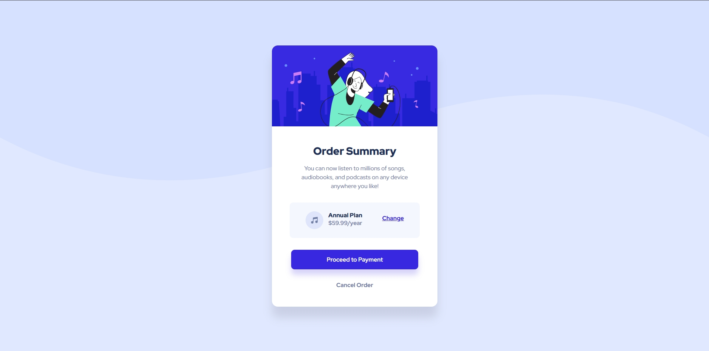

# Frontend Mentor - Order Summary Card solution

This is a solution to the [Order Summary Card challenge on Frontend Mentor](https://www.frontendmentor.io/challenges/order-summary-component-QlPmajDUj).  
Frontend Mentor challenges help you improve your coding skills by building realistic projects.

## Table of contents

- [Overview](#overview)
  - [The challenge](#the-challenge)
  - [Screenshot](#screenshot)
  - [Links](#links)
- [My process](#my-process)
  - [Built with](#built-with)
  - [What I learned](#what-i-learned)
  - [Continued development](#continued-development)
- [Author](#author)

---

## Overview

### The challenge

Users should be able to:

- See hover states for interactive elements

### Screenshot



### Links

- Solution URL: [Add solution URL here](https://your-solution-url.com)
- Live Site URL: [Add live site URL here](https://your-live-site-url.com)

---

## My process

### Built with

- Semantic HTML5 markup
- CSS custom properties
- Flexbox
- Mobile-first workflow

### What I learned

This project helped me practice the **mobile-first approach**, ensuring that the layout looks great on small screens first, and then adapting it to larger ones.  
I also improved my understanding of **Flexbox alignment** to center content both vertically and horizontally.

Example of the CSS centering used:

```css
.container {
  display: flex;
  flex-direction: column;
  align-items: center;
  justify-content: center;
}
```

### Continued development

I want to keep improving in:

- Responsive design for complex layouts
- Using CSS Grid for components with multiple sections
- Creating reusable styles with variables

## Author

- Frontend Mentor - @juanfeoru
- Twitter - @juanfeoru
